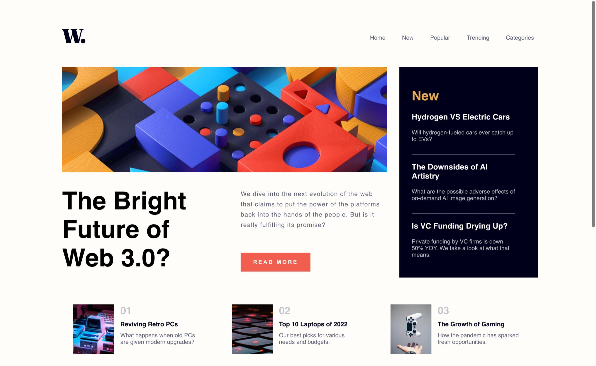

# Frontend Mentor - News homepage solution

This is a solution to the [News homepage challenge on Frontend Mentor](https://www.frontendmentor.io/challenges/news-homepage-H6SWTa1MFl). Frontend Mentor challenges help you improve your coding skills by building realistic projects. 

## Table of contents

- [Overview](#overview)
  - [The challenge](#the-challenge)
  - [Screenshot](#screenshot)
  - [Links](#links)
- [My process](#my-process)
  - [Built with](#built-with)
  - [What I learned](#what-i-learned)
  - [Useful resources](#useful-resources)
- [Author](#author)
- [About the project](#about-the-project)
  - [Where to find everything](#where-to-find-everything)
  - [Getting Started with Create React App](#getting-started-with-create-react-app)
  - [Available Scripts](#available-Scripts)


## Overview

### The challenge

Users should be able to:

- View the optimal layout for the interface depending on their device's screen size
- See hover and focus states for all interactive elements on the page

### Screenshot



### Links

- Solution URL: [Solution 🎉](https://www.frontendmentor.io/solutions/responsive-homepage-2Q98xDI6cE)
- Live Site URL: [Deployed on Onrender](https://news-vrdt.onrender.com)

## My process

### Built with

- CSS custom properties
- Mobile-first workflow
- [React](https://reactjs.org/) - JS library
- [Styled Components](https://styled-components.com/) - For styles


### What I learned

I learned how to use the react-responsive library to render a different component based on screen size:

```js
import React from 'react';
import { useMediaQuery } from 'react-responsive';

 {/* Hidden content */}

const isMobile = useMediaQuery({query: ' (max-width: 425px)'});

  return (
    <div>
      {isMobile ? <MobileComponent /> : <DesktopComponent />}
    </div>
  );

 {/* Hidden content */}


```

If you want more help with writing markdown, we'd recommend checking out [The Markdown Guide](https://www.markdownguide.org/) to learn more.


### Useful resources

- [React Icons](https://react-icons.github.io/react-icons) 


## Author

- Frontend Mentor - [@ElianaNeto](https://www.frontendmentor.io/profile/ElianaNeto)
- Twitter - [@eliana__neto](https://twitter.com/eliana__neto)

## About the project

### Where to find everything

The task is to build out the project to the designs inside the `/design` folder. You will find both a mobile and a desktop version of the design. 

The designs are in JPG static format. Using JPGs will mean that you'll need to use your best judgment for styles such as `font-size`, `padding` and `margin`. 

If you would like the design files (we provide Sketch & Figma versions) to inspect the design in more detail, you can [subscribe as a PRO member](https://www.frontendmentor.io/pro).

All the required assets for this project are in the `/assets` folder. The images are already exported for the correct screen size and optimized.

There are also included variable and static font files for the required fonts for this project. You can choose to either link to Google Fonts or use the local font files to host the fonts yourself. Note that we've removed the static font files for the font weights that aren't needed for this project.

There is also a `style-guide.md` file containing the information you'll need, such as color palette and fonts.


### Getting Started with Create React App

This project was bootstrapped with [Create React App](https://github.com/facebook/create-react-app).

### Available Scripts

In the project directory, you can run:

#### `npm start`

Runs the app in the development mode.\
Open [http://localhost:3000](http://localhost:3000) to view it in your browser.

The page will reload when you make changes.\
You may also see any lint errors in the console.


